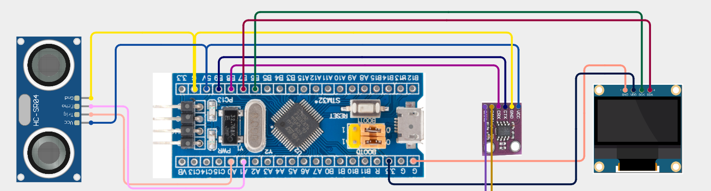

## Real-Time Multi-Node Pipeline System

This system is designed around a **three-node distributed architecture**, where each node (CPU) is responsible for a specific stage in the **Sensor → Process → Control** pipeline. Communication between nodes is synchronized using the **CAN bus**, and tasks on each node are executed concurrently using **FreeRTOS** for real-time performance.

---
### Hardware Configuration

- **MCU:** STM32F103C8T6 on all nodes
- **CAN Transceiver:** MCP2551 (or compatible)
- **Programming Interface:** ST-Link v2 (genuine or clone/fake)
- **Development Platform:** PlatformIO with `libopencm3`

---

### Clone/fake Compatibility

- Works reliably with **clone/fake STM32F103C8T6 chips**
- Fully compatible with **ST-Link V2 clone/fake programmers**

> This setup ensures low-cost prototyping without sacrificing functionality or stability.

---

### System Architecture

#### **Node 1: Sensor Node**
- Reads real-time data from various sensors (e.g., ultrasonic, IMU, etc.)
- Packages the raw data and sends it to Node 2 via CAN bus

#### **Node 2: Processing Node**
- Receives sensor data from Node 1
- Performs computational tasks such as filtering, logic decisions, or complex calculations
- Sends control decisions to Node 3 over CAN

#### **Node 3: Control Node**
- Receives commands from Node 2
- Executes control actions on actuators (e.g., motors, LEDs, displays, etc.)

---

### Data Flow and Optimization

Instead of following the traditional polling structure, which takes `n × 3` steps for `n` actions (each requiring sensor-read → process → control), this system reduces the pipeline to `n + 2` steps by parallelizing each stage across separate nodes:

---
### Wiring Diagram
You can get more [here](https://app.cirkitdesigner.com/project/8f69f60e-202c-4021-81ad-9d32403ceb5b)


Below are the wiring diagrams showing the CAN bus connections and peripheral interfaces for each node and the overall system:


#### Node 1 – Sensor Node
Handles sensor readings and transmits data via CAN.



---

#### Node 2 – Processing Node
Receives sensor data, performs calculations, and sends control commands.


---

#### Node 3 – Control Node
Receives processed commands and drives actuators accordingly.


---

#### Full System Overview
Illustrates the complete multi-node architecture and CAN bus topology.


---

## How to Use This Codebase

Follow these steps to build and upload firmware for each node in the system:

### 1. Create a New Project with PlatformIO

- Board: `bluepill_f103c8`
- Framework: `libopencm3`

```bash
pio project init --board bluepill_f103c8 --framework libopencm3
```

Or use the PlatformIO VS Code GUI to create a project with:
- **Board:** STM32F103C8 (Blue Pill)
- **Framework:** libopencm3

---

### 2. Copy Codebase into Your Project

- Copy all folders and files from the provided source code into your new PlatformIO project folder.
- Replace all existing files when prompted (e.g., `src/`, `include/`, `platformio.ini`).

---

### 3. Select the Node to Build and Flash

Open `src/main.cpp`, then:

- **Comment out** the includes and function calls of the nodes **you are not using**
- **Uncomment** only the code for the **target node** you want to compile and flash

Example:
```cpp
// #include "NODE1.h"
// #include "NODE2.h"
#include "NODE3.h"

int main(void) {
    // node1_main(); // comment this
    // node2_main(); // comment this
    node3_main();   // uncomment only the node you want to flash
}
```

> Repeat this process for each node you want to flash (Node1, Node2, Node3), one at a time.

---

### 4. Build and Upload

Plug in your **ST-Link** and run:

```bash
pio run --target upload
```

Or click **Upload** in PlatformIO VS Code GUI.

---

### Done!

You have now successfully flashed the desired node. Repeat steps for the remaining nodes using the same method.


